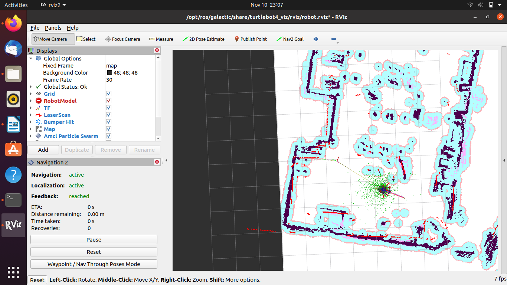

# Trudy the Turtle

## Step 1: Getting Started and `teleop`

We first turned our robot on a plugged it into the power and then we heard the two chimes and waited for it to show up on the wifi. When it wasn't showing up we held the two buttons on either side of the power button and then it showed up on the wifi. Then we waited for it to connect and went to the webpage. We then watched the videos about navigation and map building and started to take the steps to complete that with our robot.

## Step 2: Implementation Details

For this project we had our Turtlebot4 do a navigation task. We started by creating a map of the campus center with its obstacles such as the pillars, tables, and chairs. We also generated a map of ALIC using the same method. This method involved running slam `ros2 launch turtlebot4_navigation slam_sync.launch.py` followed by launching rviz `ros2 launch turtlebot4_viz view_robot.launch.py`. Next we connected to the robot with teleop and drove the robot around to generate the map. We then used the following command to save the map:

```bash
ros2 service call /slam_toolbox/save_map slam_toolbox/srv/SaveMap "name:
  data: 'map_name'"
```

It's worth noting the new line. If you don't include this new line, the command will not work. It's also worth noting that you have to copy and paste this in with the new line as adding a escaped new line character doesn't work, nor does adding a new line inside the terminal.

To start navigating, first load a map using the following command `ros2 launch turtlebot4_navigation nav_bringup.launch.py slam:=off localization:=true map:=[alic or campuscenter].yaml`. Then launch rviz to visualize it: `ros2 launch turtlebot4_viz view_robot.launch.py`. Once in rviz you can set a initial pose and a goal and the robot will navigate to the goal. Don't forget to disconnect from teleop before starting the navigation process.

## Outcomes

In this activity when we opened the rviz applications with our saved map we we able to click on the 2D Pose Estimate and then we clicked on the Nav2 Goal. When we took these actions the map generated a fuzzy blue outline around anywhere on the map where there was an obstacle. After having clicked on the 2D Pose Estimate you could then click somewhere on the map to indicate the location you wanted your robot to reach. After doing this your robot would find a route around obstacles to the final destination. The red line indicates the route the robot intends to take and the black dot with dispersing green color around it indicates the robot itself.

Setting the pose:
[2D Pose]`./set_2d_pose_estimate.png`

Pathfinding to a location:
[Pathfinding]`./travelling_to_nav2_goal.png`


